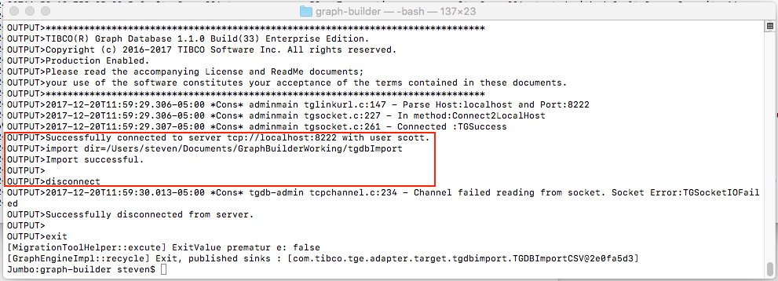

Tibco GraphBuilder - Command Line Mode
======================================

Getting Started Guide

Revision History
----------------

| Version | Date | Author | Comments         |
|---------|------|--------|------------------|
| 0.1     |      |        | Initial Document |

Copyright Notice

COPYRIGHT© 2017 TIBCO Software Inc. This document is unpublished and the foregoing notice is affixed to protect TIBCO Software Inc. in the event of inadvertent publication. All rights reserved. No part of this document may be reproduced in any form, including photocopying or transmission electronically to any computer, without prior written consent of TIBCO Software Inc. The information contained in this document is confidential and proprietary to TIBCO Software Inc. and may not be used or disclosed except as expressly authorized in writing by TIBCO Software Inc. Copyright protection includes material generated from our software programs displayed on the screen, such as icons, screen displays, and the like.

Trademarks

Technologies described herein are either covered by existing patents or patent applications are in progress. All brand and product names are trademarks or registered trademarks of their respective holders and are hereby acknowledged.

Confidentiality

The information in this document is subject to change without notice. This document contains information that is confidential and proprietary to TIBCO Software Inc. and may not be copied, published, or disclosed to others, or used for any purposes other than review, without written authorization of an officer of TIBCO Software Inc. Submission of this document does not represent a commitment to implement any portion of this specification in the products of the submitters.

Content Warranty

The information in this document is subject to change without notice. THIS DOCUMENT IS PROVIDED "AS IS" AND TIBCO MAKES NO WARRANTY, EXPRESS, IMPLIED, OR STATUTORY, INCLUDING BUT NOT LIMITED TO ALL WARRANTIES OF MERCHANTABILITY OR FITNESS FOR A PARTICULAR PURPOSE. TIBCO Software Inc. shall not be liable for errors contained herein or for incidental or consequential damages in connection with the furnishing, performance or use of this material.

For more information, please contact:

TIBCO Software Inc.

3303 Hillview Avenue

Palo Alto, CA 94304

USA

Table of Contents

1.  Preface
    =======

    -   Purpose Of Document
        -------------------

    -   Scope
        -----

> The scope of the document is

-   Running GraphBuild in command line mode.

-   Description of house member migration plan.

    -   Reference Documents
        -------------------

Installation
============

-   Download graphBuilder.zip from ….

-   Extract the folders from the zip file to your file system, you will have a folder named graph-builder with the following structure

> 

-   components (Server Mode Only)

-   exeJar : where executable jar file resides. Current release is *TGBuilder-0.9.0.jar*

-   grapgModels (Server Mode Only)

-   resources : Data repository to host data in relational model which data source is connect to.

-   samples : Contains configuration samples for command line mode (CLMigrationPlans) and server mode.

-   Scripts : scripts used for triggering external process (for example to import data to external graphical database).

-   server.json (Server Mode only)

-   start.sh : Linux/Mac shell script for launching GraphBuilder in command line mode.

-   startServer.sh (Server Mode only)

Command Line Mode
=================

The following outlines the steps required to run GraphBuilder from the command line:

-   Update or create a configuration file. For command line mode, configurations are called migration plans and are specified using json. The installation provides sample configuration files and are located under &lt;GRAPH\_BUILDER\_HOME&gt;/samples/CLMigrationPlans

    -   Update dataSources and dataSinks sections accordingly

-   Switch to the &lt;GRAPH\_BUILDER\_HOME&gt; folder

-   Update start.sh script.

    -   Edit the export GRAPH\_BUILDER\_HOME command to point to the path where graph builder was installed

    -   Edit the java command -C option to point to the migration plan configuration file. You can use absolute or relative paths.

-   Start the graph builder by typing:

    -   ./start.sh

The console output below shows the execution of the migration plan specified in the start.sh script. For example, the output below shows the output for the houseMember.console.cl.json configuration.

For the example above, graphbuilder used:

-   Migration plan located at ./samples/CLMigrationPlans/*houseMember.console.cl.json*

-   Data source fetches data from ./resources/houseMember folder

-   Data sink just simply dump result on the console.

Migration Plan
==============

-   Overview
    --------

> A migration plan is a configuration in json format which contains following blocks. Each block contains descriptor of one component type. They define where ( and how) data comes, how relational data get build as a graph and how graph data get imported to external graph databases.

-   dataSources :

> Define your relational data external sources. Currently there are two built-in data sources - CSV and JDBC.

-   dataSinks :

> Define data sink component which consumes internal data (in graph model) ,transform and output data to external graph database. TIBCO GraphDB, DGraph and Neo4J data sink are currently available.

-   dataPreprocessors (optional):

> Data preprocessor consume the (row by row) data from data source. After transformation it will pass data to GraphBuild engine.

-   Graphs :

> A graph is a logic space which host the final data in graph model. The descriptor of graph space contains instruction of converting data from relational model to graph model.

-   dataSources
    -----------

> Data source descriptor

-   id : User defined unique id.

-   javaClass : Java class name of data source component.

-   configuration : Configuration items vary between data sources. In above example (CSV)

    -   url is the path to the folder contains csv files.

    -   timestampFormat define the string format of (data source level) timestamp field.

    -   nullValueRepresentation is the string represent of null field.

-   queries : A query is a table view of data.

    -   Id : User defined unique id.

    -   For a JDBC data source a query map to a SQL statement.

    -   For a CSV data source a query map to a csv file.

    -   dataPreprocessors : Id of data preprocessors which will apply to data from current view. Will apply to the data in the sequence of defined order.

    -   properties : property keys vary between data sources. In above example (CSV)

        -   filename : the filename of csv file which contains data.

        -   timestampFormat define the string format of (query level - will override data source level one) timestamp field.

        -   schema.&lt;data column name&gt; define the data type of output data schema. Default data type is string.

-   Here is a data view (member) for one of the queries.

-   dataPreprocessors
    -----------------

> Data preprocessor consume the (row by row) data from data source. After transformation it will pass data to GraphBuild engine. Following are two general purpose data preprocessors. Both of them are stateless.

-   id : user defined unique id.

-   javaClass : The Java class name of preprocessor.

-   You can deploy many preprocessors using same java class (with different configuration) but you have to give them different id.

-   Regex string replacing (data preprocessor) : match and replace a string with new one.

    -   Key could be any column name or use \* to represent applying to all columns.

    -   targetRegex : regex to match target string.

    -   Replacement : to replace the target string.

-   Character replacing (data preprocessor) : match and replace a target character.

    -   Key could be any column name or use \* to represent applying to all columns.

    -   Replacing logic is an array of key value pairs. Each key represents target character and value represent the its replacement.

-   dataSinks
    ---------

> The DefaultSink we are using in the first run is the simplest one. It just simply print graph model on the console (if you don’t setup output folder). It’s sometimes very useful for the troubleshooting.

-   id : user defined unique id.

-   javaClass : The Java class name of data sink.

-   configuration : like all other component configuration items vary among different data sink. The one (Default Sink) we use only has two items.

    -   formatForJavaCalendar : Assign the string format for Calendar type of data or it will be a big string when you see them on console. The format setup see Java SimpleDateFormat class.

    -   outputFolder : After you setup outputFolder for DefaultSink the output will go to a file call defaultSink.log instead of console.

-   Here is the output file which contains graph model (nodes and edges).

-   Graphs
    ------

> Graph is the most complicated component in a migration plan. It consists of nodes and their edges (relation between nodes). A node could represent a data row or even a data column. In the following graph (houseMember) there are two nodes setup. Both of them are represent same node type (houseMemberType) but they trigger very different action while building the graph.
>
> The graph building process is in sequential which follow the order we defined in the graph. The upper node configuration will be executed before lower one. Here is the process.

-   The first node configuration get executed

    -   Data will be fetched by the query houseMember.member (&lt;data source&gt;.&lt;query&gt;). So we know data comes from file:////Users/steven/git/conversationalgraph/TGCache/resources/houseMember/houseMemberData.csv row by row.

    -   Each data row will be processed by charReplacingDataPreprocessor then pass to graph component.

    -   In graph component the columns will be picked and converted to node attributes according to the setup in columnToAttrMap block.

    -   Then the value of one or many attributes which name defined in nodeKey (an array) will be promoted as key of current node instance. In current example the attribute value of memberName(column name is memberName too) will be the key.

    -   If a node (with same keys) exists no new node will be created. Attributes will be merge to old instance.

-   The second node configuration will be executed after the first node is done.

    -   Data will be fetched by the query houseMember.relation (&lt;data source&gt;.&lt;query&gt;). So data comes from file:////Users/steven/git/conversationalgraph/TGCache/resources/houseMember/houseRelationData.csv row by row.

    -   Each data row will be processed by regexStringReplacingDataProcessor then pass to graph component.

    -   In graph component the columns will be picked and converted to node attributes according to the setup in columnToAttrMap block.

    -   The second one has a nested configuration structure and each structure could potentially create a new node or map to an existing node.

    -   The outer node configuration will use its houseMember attribute (original column name is fromMemberName) as key then create or find a instance of node.

    -   The inner configuration will use its houseMember attribute (original column name is toMemberName) as key then create or find a instance of node.

    -   According to the edge setup in inner node configuration an edge will be created to link the nodes which generated from outer and inner node configuration.

-   After all configuration get executed data sink will be triggered. In this example defaultSink will

    -   Convert all timestamp to yyyy-MM-dd format

    -   Print all nodes then edges to console or file.

-   nodeType : user defined node type string.

-   nodeKey : an array of attribute names.

-   allowNullKeyElement : false then it will throw exception if the value of any key element is null.

-   query : &lt;data source component id&gt;.&lt;query id&gt; represent where and how data will come to the graph.

-   columnToAttrMap : Configuration for picking and converting data to attribute.

-   publicNodes : all nodes which current node has relation with.

-   edges : relations between outer node and inner node.

-   edgeType : user defined edge type string.

-   direction : direction of relation: 0=no direction, 1=from outer to inner, 2=from inner to outer, 3=bidirectional

Import to TGDB
==============

-   To do
    -----

> Running GraphBuilder to import memberHouse data to TGDB you have to install GraphBuilder on the same os with TGDB.

-   Install GraphBuilder : see section 2.

-   Install TGDB : please check the Tibco Graph Database document.

-   Launching TGDB

    -   After install TGDB switch to the bin folder under TGDB installation path. Then type *./tgdb -i -f -c ../examples/hierarchy/initdb.conf* then enter to initialize database for houseMember data. This is what you would see.

-   Launch TGDB by type *./tgdb -s -c ../examples/hierarchy/tgdb.conf* then press enter. Now TGDB is running.

-   Launching GraphBuilder :

-   Switch to the graph-builder folder and modify start.sh make the migration plan houseMember.tgdb.cl.json

-   Type ./start.sh then press enter. You should see following output from TGDB console

-   And from GraphBuilder console

-   Here is the TGDB data sink configuration

-   outputFolder : It’s a temporary folder for GraphBuilder to produce and TGDB to consume import data file.

-   tgdbHome : The root folder of your TGDB application.

-   ImportCommand : See TGDB document. %s is for GraphBuilder to set import script.

-   attibuteTypes : Data schema has to match the houseMember data instance setup.

